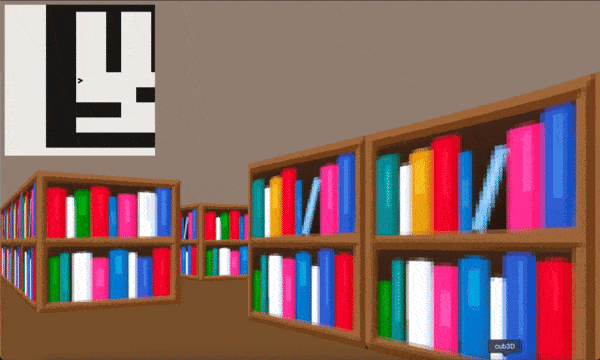

*cub3D*
-------
cub3D is a Hive project that introduces students to the basics of 3D rendering using the Raycasting technique. Inspired by classic games like Wolfenstein 3D, this project serves as a deep dive into computer graphics, game mechanics, and efficient coding practices.

🎯 Objectives

The goal of cub3D is to create a basic 3D game engine that can render a simple maze-like world from a first-person perspective. It combines knowledge of mathematics, computer graphics, and software design to achieve this.

✨ Features

- Raycasting: Render a 3D perspective using 2D map data.
- Dynamically calculate walls, distances, and textures based on the player's point of view.
- Player movement: Smooth forward, backward, and strafing movement.
- Rotational controls for a first-person camera effect (mouse & keyboard).
- Textures and colors: Apply textures to walls for a realistic appearance.
- Customize floor and ceiling colors.
- Minimap: Display a 2D overhead view of the map for navigation.
- Map parsing: Read and validate .cub map files.
- Enforce proper formatting and boundaries.

This was a Hive group project done together with https://github.com/usmanUA
